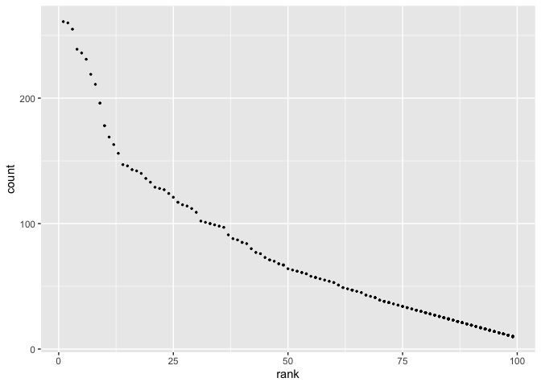

Homework 2
================
Lydia Parr
2019-10-09

## Setup

First, I am loading relevant packages.

``` r
library(tidyverse)
```

    ## ── Attaching packages ─────────────────────────────────────── tidyverse 1.3.1 ──

    ## ✓ ggplot2 3.3.4     ✓ purrr   0.3.4
    ## ✓ tibble  3.1.2     ✓ dplyr   1.0.7
    ## ✓ tidyr   1.1.3     ✓ stringr 1.4.0
    ## ✓ readr   1.4.0     ✓ forcats 0.5.1

    ## ── Conflicts ────────────────────────────────────────── tidyverse_conflicts() ──
    ## x dplyr::filter() masks stats::filter()
    ## x dplyr::lag()    masks stats::lag()

``` r
library(readxl)
library(dplyr)
library(ggplot2)
library(knitr)
```

## Problem 1

I placed the Mr. Trash Wheel data set into a subdirectory named
hw2\_data within this one, p8105\_hw2\_lcp2148. I renamed it
`trash_wheel.xlsx` for ease of use.

Next, I am reading in the Excel file and cleaning by:

-   specifying the sheet in the Excel file
-   omitting non-data entries (rows with notes / figures; columns
    containing notes)
-   omitting rows that do not include dumpster-specific data
-   converting variable names to snake case
-   rounding the number of sports balls to the nearest integer

``` r
mr_trash = read_excel("./hw2_data/trash_wheel.xlsx", sheet = "Mr. Trash Wheel", cellranger::cell_cols(1:14)) %>% drop_na() %>%
  janitor::clean_names() %>% 
   mutate(sports_balls = round(sports_balls))
```

Now I am reading and cleaning precipitation data for 2018 and 2019. I
will omit rows without precipitation data and add a variable for year
before combining the precipitation data sets and converting month to a
character variable.

``` r
precip2018 = read_excel("./hw2_data/trash_wheel.xlsx", sheet = "2018 Precipitation", skip = 1)
precip2018 = mutate(precip2018, 
       year = 2018) %>% janitor::clean_names()

precip2019 = read_excel("./hw2_data/trash_wheel.xlsx", sheet = "2019 Precipitation", skip = 1)
precip2019 = mutate(precip2019, 
       year = 2019) %>% janitor::clean_names()

precipboth = bind_rows(precip2018, precip2019) %>% drop_na() 

dfmnth = tibble(
  month = 1:12, 
  mnth = c(month.name[month]))

precipfinal = left_join(precipboth, dfmnth, by = "month") %>% 
  select(-c(month)) %>% 
  rename(month = mnth, precip_in = total)
```

Key variables in Mr Trash Wheel include dumpster, month, year, date,
weight\_tons, volume\_cubic\_yards, plastic\_bottles, polystyrene,
cigarette\_butts, glass\_bottles, grocery\_bags, chip\_bags,
sports\_balls, homes\_powered. The number of observations in this data
set is 456. The median number of sports balls in a dumpster in 2019 9.

For the precipitation data set, the variables are precip\_in, year,
month. Total precipitation in 2018 was 70.33 in.

## Problem 2

First I am importing pols-month.csv, unemployment.csv, and snp.csv.
tasks– month and year will be keys to merge data sets I cleaned the data
in pols-month.csv. Use separate() to break up the variable mon into
integer variables year, month, and day; replace month number with month
name; create a president variable taking values gop and dem, and remove
prez\_dem and prez\_gop; and remove the day variable.

Second, clean the data in snp.csv using a similar process to the above.
For consistency across datasets, arrange according to year and month,
and organize so that year and month are the leading columns.

Third, tidy the unemployment data so that it can be merged with the
previous datasets. This process will involve switching from “wide” to
“long” format; ensuring that key variables have the same name; and
ensuring that key variables take the same values.

Join the datasets by merging snp into pols, and merging unemployment
into the result.

``` r
pols_month = read_csv(file = "./hw2_data/pols-month.csv") %>%
  janitor::clean_names() %>% 
  pivot_longer(
    cols = starts_with("prez_"),
    names_prefix = "prez_",
    names_to = "president")  %>%
  mutate(year = lubridate::year(mon), 
                month = lubridate::month(mon), 
                day = lubridate::day(mon)) %>% 
  left_join( dfmnth, by = "month")  %>% 
  select(-c(day, month))
```

    ## 
    ## ── Column specification ────────────────────────────────────────────────────────
    ## cols(
    ##   mon = col_date(format = ""),
    ##   prez_gop = col_double(),
    ##   gov_gop = col_double(),
    ##   sen_gop = col_double(),
    ##   rep_gop = col_double(),
    ##   prez_dem = col_double(),
    ##   gov_dem = col_double(),
    ##   sen_dem = col_double(),
    ##   rep_dem = col_double()
    ## )

``` r
unempl = read_csv(file = "./hw2_data/unemployment.csv") %>%
    janitor::clean_names() %>%
  pivot_longer(
    jan:dec,
    names_to = "mnth",
    values_to = "unemployment") %>%
  mutate(mnth = recode(mnth,
                       jan = "January", feb = "February", mar = "March", 
                       apr = "April", may = "May", jun = "June", 
                       july = "July", aug = "August", sep = "September", 
                       oct = "October", nov = "November", dec = "December"))
```

    ## 
    ## ── Column specification ────────────────────────────────────────────────────────
    ## cols(
    ##   Year = col_double(),
    ##   Jan = col_double(),
    ##   Feb = col_double(),
    ##   Mar = col_double(),
    ##   Apr = col_double(),
    ##   May = col_double(),
    ##   Jun = col_double(),
    ##   Jul = col_double(),
    ##   Aug = col_double(),
    ##   Sep = col_double(),
    ##   Oct = col_double(),
    ##   Nov = col_double(),
    ##   Dec = col_double()
    ## )

``` r
snp = read_csv(file = "./hw2_data/snp.csv") %>%
  janitor::clean_names() %>%
  separate(date, into = c("month", "day", "year"), convert = TRUE) %>%
  mutate(year = ifelse(year > 15, year + 1900, year + 2000)) %>% 
  left_join(dfmnth, by = "month")  %>% 
  select(-c(day, month))
```

    ## 
    ## ── Column specification ────────────────────────────────────────────────────────
    ## cols(
    ##   date = col_character(),
    ##   close = col_double()
    ## )

``` r
merged_538 =
  left_join(snp, pols_month, by = c("year", "mnth"))  %>% 
  left_join(., unempl, by = c("year", "mnth")) %>% 
  rename(month = mnth) %>% drop_na() %>% 
  select(-c(mon))
```

The `pols_month` data set contains data on the party affiliation of the
current president and number of republican and democratic governors,
senators, and senators on specific dates, which were changed to indicate
year and month. The representative of the merged data set, `merged_538`,
is 1442, 12. The range of years in this merged data set is 1950, 2015.
The names of key variables are month and year, out of the total
variables in the data set, year, close, month, gov\_gop, sen\_gop,
rep\_gop, gov\_dem, sen\_dem, rep\_dem, president, value, unemployment.

## Problem 3

Next, I’m importing the baby names data and cleaning by correcting
ethnicity names typos to match, making the case structure of the name
variable consistent, and removing the duplicate rows.

``` r
baby_names = read_csv(file = "./hw2_data/Popular_Baby_Names.csv", col_types = "dcccdd")  %>%
  janitor::clean_names() %>%
  distinct() %>%
  mutate(childs_first_name = tolower(childs_first_name)) %>%
  mutate(gender = tolower(gender)) %>%
  mutate(ethnicity = tolower(ethnicity)) 

baby_names$ethnicity[baby_names$ethnicity == "asian and paci"] = "asian and pacific islander" 
baby_names$ethnicity[baby_names$ethnicity == "black non hisp"] = "black non hispanic" 
baby_names$ethnicity[baby_names$ethnicity == "white non hisp"] = "white non hispanic"
```

Next, I make a table using `pivot_wider` showing the rank in popularity
of the name “Olivia” as a female baby name over time including rows for
ethnicities and columns for year.

I then make a table using a similar process showing the most popular
name among male children over time.

For male, white non-hispanic children born in 2016, I use `ggplot` to
make a scatter plot showing the number of children with a name against
the rank in popularity of that name. \#\# %&gt;% \#\#knitr::kable(format
= “pipe”, col.names = gsub(“\[\_\]”, " “, names, caption =”Popularity of
\#\#the name Olivia over time")

``` r
baby_names %>%  
  select(childs_first_name, gender, ethnicity, year_of_birth, rank) %>%  
  filter(childs_first_name == "olivia", gender == "female")  %>%
  arrange(year_of_birth)  %>%
  pivot_wider(
    names_from = "year_of_birth",
    values_from = "rank"
  ) 
```

    ## # A tibble: 4 x 9
    ##   childs_first_name gender ethnicity   `2011` `2012` `2013` `2014` `2015` `2016`
    ##   <chr>             <chr>  <chr>        <dbl>  <dbl>  <dbl>  <dbl>  <dbl>  <dbl>
    ## 1 olivia            female asian and …      4      3      3      1      1      1
    ## 2 olivia            female black non …     10      8      6      8      4      8
    ## 3 olivia            female hispanic        18     22     22     16     16     13
    ## 4 olivia            female white non …      2      4      1      1      1      1

``` r
baby_names %>%  
  select(childs_first_name, gender, ethnicity, year_of_birth, rank) %>%  
  filter(gender == "male", rank == 1)  %>%
  arrange(year_of_birth)  %>%
  pivot_wider(
    names_from = "year_of_birth",
    values_from = "childs_first_name"
  ) 
```

    ## # A tibble: 4 x 9
    ##   gender ethnicity                rank `2011` `2012` `2013` `2014` `2015` `2016`
    ##   <chr>  <chr>                   <dbl> <chr>  <chr>  <chr>  <chr>  <chr>  <chr> 
    ## 1 male   asian and pacific isla…     1 ethan  ryan   jayden jayden jayden ethan 
    ## 2 male   black non hispanic          1 jayden jayden ethan  ethan  noah   noah  
    ## 3 male   hispanic                    1 jayden jayden jayden liam   liam   liam  
    ## 4 male   white non hispanic          1 micha… joseph david  joseph david  joseph

``` r
baby_names %>% filter(ethnicity == "white non hispanic", year_of_birth == 2016, 
                      gender == "male")  %>% ggplot(aes(rank, count)) + geom_point(size = 0.5) + ggtitle("Number and rank of names among white male children born in 2016")
```

<!-- -->
