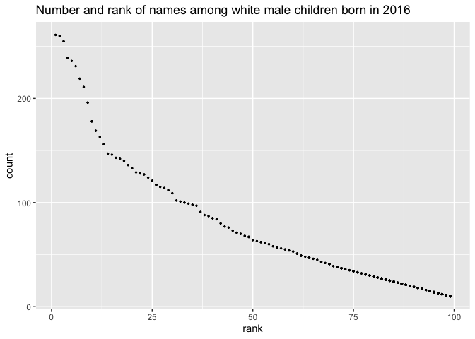

Homework 2
================
Lydia Parr
2019-10-09

## Setup

First, I am loading relevant packages.

``` r
library(tidyverse)
library(readxl)
library(dplyr)
library(ggplot2)
library(knitr)
```

## Problem 1

I placed the Mr. Trash Wheel data set into a subdirectory named
`hw2_data` within `p8105_hw2_lcp2148`. I renamed it `trash_wheel.xlsx`,
because I thought this would be a SAS-like situation.

Next, I am reading in the Excel file and cleaning by:

-   specifying the sheet in the Excel file
-   omitting non-data entries (rows with notes / figures; columns
    containing notes)
-   omitting rows that do not include dumpster-specific data using
-   converting variable names to snake case with `janitor::clean_names`
-   rounding the number of sports balls to the nearest integer

``` r
mr_trash = read_excel("./hw2_data/trash_wheel.xlsx", sheet = "Mr. Trash Wheel", cellranger::cell_cols(1:14)) %>% drop_na() %>%
  janitor::clean_names() %>% 
   mutate(sports_balls = round(sports_balls))
```

Now I am reading and cleaning precipitation data for 2018 and 2019. I
will omit rows without precipitation data and add a variable for year
before combining the precipitation data sets and converting month to a
character variable.

``` r
precip2018 = read_excel("./hw2_data/trash_wheel.xlsx", sheet = "2018 Precipitation", skip = 1)
precip2018 = mutate(precip2018, 
       year = 2018) %>% janitor::clean_names()

precip2019 = read_excel("./hw2_data/trash_wheel.xlsx", sheet = "2019 Precipitation", skip = 1)
precip2019 = mutate(precip2019, 
       year = 2019) %>% janitor::clean_names()

precipboth = bind_rows(precip2018, precip2019) %>% drop_na() 

dfmnth = tibble(
  month = 1:12, 
  mnth = c(month.name[month]))

precipfinal = left_join(precipboth, dfmnth, by = "month") %>% 
  select(-c(month)) %>% 
  rename(month = mnth, precip_in = total)
```

Key variables in Mr Trash Wheel include dumpster, month, year, date,
weight\_tons, volume\_cubic\_yards, plastic\_bottles, polystyrene,
cigarette\_butts, glass\_bottles, grocery\_bags, chip\_bags,
sports\_balls, homes\_powered. The number of observations in this data
set is 456. The median number of sports balls in a dumpster in 2019 was
9.

For the precipitation data set, the variables are precip\_in, year,
month. Total precipitation in 2018 was 70.33 in.

## Problem 2

First I am importing `pols-month.csv`, `unemployment.csv`, and
`snp.csv`, then I am cleaning them.

For `pols_month`:

-   I use `separate` to break up the variable `mon` into integer
    variables year, month, and day, then replace month number with month
    name
-   I create a president variable taking values gop and dem, remove the
    variables used to derive president variable, and remove the day
    variable

For `snp`:

-   I arrange according to year and month and organize so that year and
    month are the leading columns

For `unemployment`:

-   I use `pivot_longer` to switch from “wide” to “long” format
-   I change month and year variables to match with the other two data
    sets

I finally use left\_join to merge `snp` into `pols_month`, and then I
merge `unemployment` into the two and remove unneeded variables.

``` r
pols_month = read_csv(file = "./hw2_data/pols-month.csv") %>%
  janitor::clean_names() %>% 
  pivot_longer(
    cols = starts_with("prez_"),
    names_prefix = "prez_",
    names_to = "president")  %>%
  mutate(year = lubridate::year(mon), 
                month = lubridate::month(mon), 
                day = lubridate::day(mon)) %>% 
  left_join( dfmnth, by = "month")  %>% 
  select(-c(day, month))

snp = read_csv(file = "./hw2_data/snp.csv") %>%
  janitor::clean_names() %>%
  separate(date, into = c("month", "day", "year"), convert = TRUE) %>%
  mutate(year = ifelse(year > 15, year + 1900, year + 2000)) %>% 
  left_join(dfmnth, by = "month")  %>% 
  select(-c(day, month)) 

col_fix = c("year", "mnth", "close")

snp = snp[, col_fix]

unempl = read_csv(file = "./hw2_data/unemployment.csv") %>%
    janitor::clean_names() %>%
  pivot_longer(
    jan:dec,
    names_to = "mnth",
    values_to = "unemployment") %>%
  mutate(mnth = recode(mnth,
                       jan = "January", feb = "February", mar = "March", 
                       apr = "April", may = "May", jun = "June", 
                       july = "July", aug = "August", sep = "September", 
                       oct = "October", nov = "November", dec = "December"))

merged_538 =
  left_join(snp, pols_month, by = c("year", "mnth"))  %>% 
  left_join(., unempl, by = c("year", "mnth")) %>% 
  rename(month = mnth) %>% drop_na() %>% 
  select(-c(mon, gov_gop, gov_dem, rep_gop, rep_dem, sen_gop, sen_dem, value))
```

The `pols_month` data set contains data on the party affiliation of the
current president and number of republican and democratic governors,
senators, and representatives on specific dates, which were changed to
indicate year and month. `snp` includes the closing values of the S&P
stock index on specific dates and the associated date variable, and
`unemployment` has twelve month variables indicating percent
unemployment for that month of a specific year along with a respective
year.

The dimension of the merged data set, `merged_538`, is 1442, 5. The
range of years in this merged data set is 1950, 2015. The names of key
variables are month and year, out of the total variables in the data
set, year, month, close, president, unemployment.

## Problem 3

Next, I’m importing the baby names data and cleaning by correcting
ethnicity names typos to match, making the case structure of the name
variable consistent, and removing the duplicate rows.

``` r
baby_names = read_csv(file = "./hw2_data/Popular_Baby_Names.csv", col_types = "dcccdd")  %>%
  janitor::clean_names() %>%
  distinct() %>%
  mutate(childs_first_name = tolower(childs_first_name)) %>%
  mutate(gender = tolower(gender)) %>%
  mutate(ethnicity = tolower(ethnicity)) 

baby_names$ethnicity[baby_names$ethnicity == "asian and paci"] = "asian and pacific islander" 
baby_names$ethnicity[baby_names$ethnicity == "black non hisp"] = "black non hispanic" 
baby_names$ethnicity[baby_names$ethnicity == "white non hisp"] = "white non hispanic"
```

Next, I make a table using `pivot_wider` showing the rank in popularity
of the name “Olivia” as a female baby name over time including rows for
ethnicities and columns for year.

``` r
baby_names %>%  
  select(childs_first_name, gender, ethnicity, year_of_birth, rank) %>%  
  filter(childs_first_name == "olivia", gender == "female")  %>%
  arrange(year_of_birth)  %>%
  pivot_wider(
    names_from = "year_of_birth",
    values_from = "rank") 
```

    ## # A tibble: 4 x 9
    ##   childs_first_name gender ethnicity   `2011` `2012` `2013` `2014` `2015` `2016`
    ##   <chr>             <chr>  <chr>        <dbl>  <dbl>  <dbl>  <dbl>  <dbl>  <dbl>
    ## 1 olivia            female asian and …      4      3      3      1      1      1
    ## 2 olivia            female black non …     10      8      6      8      4      8
    ## 3 olivia            female hispanic        18     22     22     16     16     13
    ## 4 olivia            female white non …      2      4      1      1      1      1

I then make a table using a similar process showing the most popular
names among male children over time.

``` r
baby_names %>%  
  select(childs_first_name, gender, ethnicity, year_of_birth, rank) %>%  
  filter(gender == "male", rank == 1)  %>%
  arrange(year_of_birth)  %>%
  pivot_wider(
    names_from = "year_of_birth",
    values_from = "childs_first_name") 
```

    ## # A tibble: 4 x 9
    ##   gender ethnicity                rank `2011` `2012` `2013` `2014` `2015` `2016`
    ##   <chr>  <chr>                   <dbl> <chr>  <chr>  <chr>  <chr>  <chr>  <chr> 
    ## 1 male   asian and pacific isla…     1 ethan  ryan   jayden jayden jayden ethan 
    ## 2 male   black non hispanic          1 jayden jayden ethan  ethan  noah   noah  
    ## 3 male   hispanic                    1 jayden jayden jayden liam   liam   liam  
    ## 4 male   white non hispanic          1 micha… joseph david  joseph david  joseph

For white non-hispanic boys born in 2016, I use `ggplot` to make a
scatter plot showing the number of children with a name against the rank
in popularity of that name.

``` r
baby_names %>% filter(ethnicity == "white non hispanic", year_of_birth == 2016, 
                      gender == "male")  %>% ggplot(aes(rank, count)) + geom_point(size = 0.5) + ggtitle("Number and rank of names among white male children born in 2016")
```

<!-- -->
